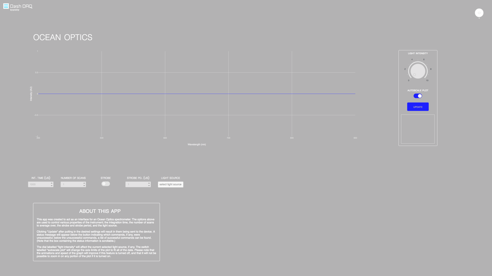
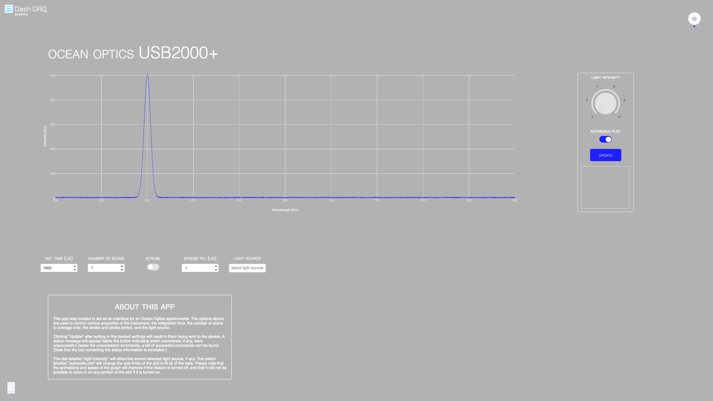
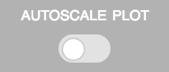
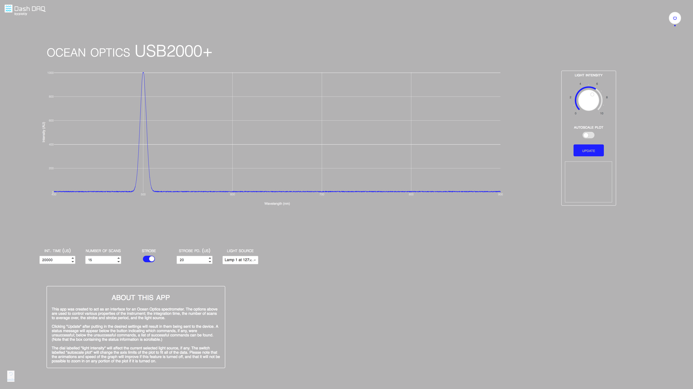
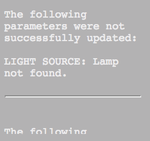

# dash-ocean-optics
## Introduction
`dash-ocean-optics` is an app created to control and read data from [Ocean Optics](https://oceanoptics.com) spectrometers. 

### Spectroscopy
Certain wavelengths of electromagnetic radiation correspond to frequencies that allow the electrons in certain atoms to transition to higher or lower energy levels; as these wavelengths are absorbed by the sample, the resulting spectrum can yield insight into the chemical composition of the sample. Read more about spectroscopy [here](https://en.wikipedia.org/wiki/Spectroscopy). 

### dash-daq
[Dash DAQ](http://dash-daq.netlify.com/#about) is a data acquisition and control package built on top of Plotly's [Dash](https://plot.ly/products/dash/).

## Requirements
It is advisable	to create a separate conda environment running Python 3 for the app and install all of the required packages there. To do so, run (any version of Python 3 will work):

```
conda create -n	[your environment name] python=3.4
```
```
source activate [your environment name]
```

After creating the conda environment, it is necessary to also have the `dash-daq-0.0.2.tar.gz` file in the same directory.

After moving the tar file to this directory, simply run:

```./install_reqs.sh```

and	all of the required `pip` packages, as well as the [`python-seabreeze`](https://github.com/ap--/python-seabreeze/) package, will be installed, and the app will be able to run.

## How to use the app
Run the app with: 

``` 
python3 app.py
```

Then, navigate to `localhost:8050` in your browser and you should see something like this: 



The controls are all disabled until the "on" button is pressed:




Then, the live spectrometer data should appear on the plot, and the model of the spectrometer should appear above the plot. It may be necessary to click on "autoscale" to view the full spectrum:



The controls below the plot will allow you to change parameters of the spectrometer. The dial labelled "light intensity" to the right of the plot will allow you to adjust the intensity of the light source selected below. 



### Controls
* int. time (us) - The integration time, in microseconds.
* number of scans - The number of scans to average over.
* strobe - Enables/disables the continuous strobe.
* strobe period (us) - The period of the continuous strobe, in microseconds.
* light source - The light source to be used.


Once they have been changed to the appropriate settings, the "UPDATE" button to the right of the plot should be pressed, and each of the settings will be sent to the spectrometer one-by-one. The small window underneath the update button will indicate whether all of the options were sent successfully, or if any of them failed (and, if so, the error that was raised).




Note that the window below the update button is scrollable!

